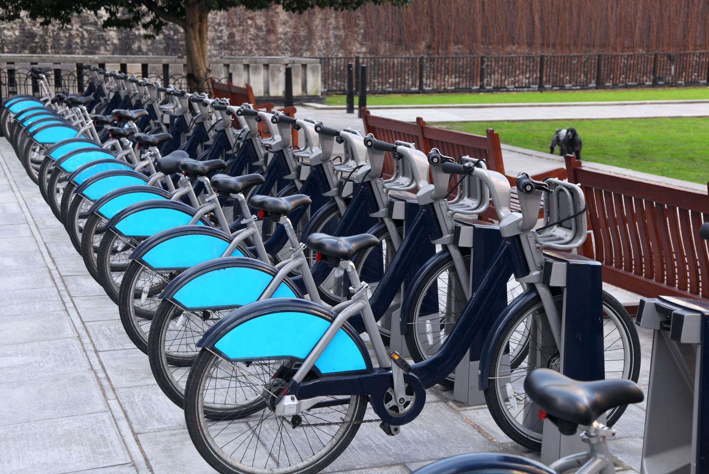

```{r setup, include=FALSE}
knitr::opts_chunk$set(echo = TRUE, 
                      warning = FALSE, 
                      message = FALSE,
                      fig.width = 20,
                      fig.height = 12)
```

## Introduction

### Background Information:

In 2016, Cyclistic launched a successful bike-share offering. Since then, the program has grown to a fleet of 5,824 bicycles that are geotracked and locked into a network of 692 stations across Chicago. The bikes can be unlocked from one station and returned to any other station in the system anytime.

Until now, Cyclistic’s marketing strategy relied on building general awareness and appealing to broad consumer segments. One approach that helped make these things possible was the flexibility of its pricing plans: single-ride passes, full-day passes, and annual memberships. Customers who purchase single-ride or full-day passes are referred to as casual riders. Customers who purchase annual memberships are Cyclistic members.

### The Problem:

Cyclistic’s finance analysts have concluded that annual members are much more profitable than casual riders. Although the pricing flexibility helps Cyclistic attract more customers, **the executive team believes that maximizing the number of annual members will be key to future growth**. Rather than creating a marketing campaign that targets all-new customers, there is a very good chance to convert casual riders into members with targeted marketing.

### Objective:

- To better understand how annual members and casual riders differ.
- To determine why casual riders would buy a membership.

**The insights generated from this analysis would allow Cyclistic to design marketing strategies aimed at converting casual riders into annual members.**



### Load Libraries

```{r}
# disable scientific notation
options(scipen = 999)

library('tidyverse')
library('lubridate')
library('ggplot2')
library('ggmap') 
library('gridExtra')
```

### Load Data

We will use data from Apr-2020 to Mar-2021 for this analysis. Data is provided by month and we will merge them into one dataframe.

```{r}
# load individual datasets

tripdata_2020_04 <- read.csv("data/csv/202004-divvy-tripdata.csv")
tripdata_2020_05 <- read.csv("data/csv/202005-divvy-tripdata.csv")
tripdata_2020_06 <- read.csv("data/csv/202006-divvy-tripdata.csv")
tripdata_2020_07 <- read.csv("data/csv/202007-divvy-tripdata.csv")
tripdata_2020_08 <- read.csv("data/csv/202008-divvy-tripdata.csv")
tripdata_2020_09 <- read.csv("data/csv/202009-divvy-tripdata.csv")
tripdata_2020_10 <- read.csv("data/csv/202010-divvy-tripdata.csv")
tripdata_2020_11 <- read.csv("data/csv/202011-divvy-tripdata.csv")
tripdata_2020_12 <- read.csv("data/csv/202012-divvy-tripdata.csv")
tripdata_2021_01 <- read.csv("data/csv/202101-divvy-tripdata.csv")
tripdata_2021_02 <- read.csv("data/csv/202102-divvy-tripdata.csv")
tripdata_2021_03 <- read.csv("data/csv/202103-divvy-tripdata.csv")
```

```{r}
# display sample data

head(tripdata_2020_04)
```

```{r}
# merging into one dataframe

full_df <- rbind(tripdata_2020_04,
                 tripdata_2020_05,
                 tripdata_2020_06, 
                 tripdata_2020_07,
                 tripdata_2020_08, 
                 tripdata_2020_09,
                 tripdata_2020_10, 
                 tripdata_2020_11,
                 tripdata_2020_12,
                 tripdata_2021_01,
                 tripdata_2021_02,
                 tripdata_2021_03)

# get dimensions of resulting dataframe
print(dim(full_df))
```

```{r}
# rename column member_casual

full_df <- full_df %>%
    rename(member_type = member_casual)
```

### Data Quality Check

```{r}
# check for duplicate rows

# get unique count of ride ID
print(n_distinct(full_df$ride_id))
```

There are 209 duplicates in the merged dataframe. We will go ahead and remove them.

```{r}
# drop duplicates
full_df <- full_df[!duplicated(full_df$ride_id), ]

# get dimensions of resulting dataframe
print(dim(full_df))

# get unique count of ride ID
print(n_distinct(full_df$ride_id))
```

```{r}
# check data types

str(full_df)
```

```{r}
# convert started_at and ended_at to datetime format

full_df$started_at <- as.POSIXct(full_df$started_at, "%Y-%m-%d %H:%M:%S", tz = 'GMT')
full_df$ended_at <- as.POSIXct(full_df$ended_at, "%Y-%m-%d %H:%M:%S", tz = 'GMT')
```

```{r}

# check resulting data type

str(full_df$started_at)
str(full_df$ended_at)
```

```{r}
# check for null values

map(full_df, ~sum(is.na(.)))
```

There are over 90k rows with null values in the end_station_id column. We will go ahead and drop them.

```{r}
# drop null values
full_df_clean <- drop_na(full_df)

# check for null values
map(full_df_clean, ~sum(is.na(.)))

# get dimensions of resulting dataframe
print(dim(full_df_clean))
```

### Data Mining

We can extract individual date parts which can be useful for our analysis.

```{r}
# extract date
full_df_clean$date <- as.Date(full_df_clean$started_at) 

# extract month
full_df_clean$month <- format(as.Date(full_df_clean$date), "%m")

# extract day
full_df_clean$day <- format(as.Date(full_df_clean$date), "%d")

# extract year
full_df_clean$year <- format(as.Date(full_df_clean$date), "%Y")

# extract day of week
full_df_clean$day_of_week <- format(as.Date(full_df_clean$date), "%A")

# extract ride start hour
full_df_clean <- full_df_clean %>%
    mutate(start_hour = strftime(full_df_clean$started_at, tz = "GMT", "%H"))
```

```{r}

# create year-month column, since our data is distributed over 2 years

full_df_clean$year_month <- paste(full_df_clean$year, "-", full_df_clean$month)
```

```{r}

head(full_df_clean)
```

We can also extract useful information from the bike rides (duration, distance etc).

```{r}
# create new column ride_duration_mins -> total ride duration in mins

full_df_clean <- full_df_clean %>%
    mutate(ride_duration_mins = as.numeric(full_df_clean$ended_at - full_df_clean$started_at) / 60)
```

```{r}
summary(full_df_clean$ride_duration_mins)
```

It appears that there are rides where the end time is before the start time. We will treat this as a data entry error and will go ahead to drop them from our dataframe.

```{r}
# check rides with negative ride duration

head(filter(full_df_clean, ride_duration_mins < 0))
```

```{r}
# number of rows with negative ride duration

dim(filter(full_df_clean, ride_duration_mins < 0))[1]
```

```{r}
# drop rows with negative ride duration
full_df_clean <- subset(full_df_clean, ride_duration_mins > 0)

# get dimensions of resulting dataframe
print(dim(full_df_clean))
```

```{r}
summary(full_df_clean$ride_duration_mins)
```

```{r, include=FALSE}
# function to calculate distance in kilometers between two points
# taking radius of earth = 6378.145 km

euclidean.dist <- function(df)
{
rad <- pi/180
a1 <- df$start_lat * rad
a2 <- df$start_lng * rad
b1 <- df$end_lat * rad
b2 <- df$end_lng * rad
dlon <- b2 - a2
dlat <- b1 - a1
a <- (sin(dlat/2))^2 + cos(a1) * cos(b1) * (sin(dlon/2))^2
c <- 2 * atan2(sqrt(a), sqrt(1 - a))
R <- 6378.145
d <- R * c

df['distance_km'] <- d
df
}
```

```{r}
# apply function

full_df_clean <- euclidean.dist(full_df_clean)
```

```{r}

head(full_df_clean)
```

### Analyse Data

```{r, include=FALSE}
# function to allow easy resizing of plots

fig <- function(width, heigth){options(repr.plot.width = width, repr.plot.height = heigth)}
```

```{r}
# number of rides by casual vs member riders

full_df_clean %>% 
    group_by(member_type) %>% 
    summarise(total_rides = length(ride_id),
              'perc_of_total' = (length(ride_id) / nrow(full_df_clean)) * 100)
```

Rides by members account for approximately 59% of the dataset for the 12-months period.

```{r, include=FALSE}
# function to calculate total rides based on selected variable

total_rides <- function(df, var)
{
var = enquo(arg = var)
new_df <- df %>%
    group_by(member_type, !!var) %>% 
    summarise(total_rides = length(ride_id),
              'perc_of_total' = (length(ride_id) / nrow(df)) * 100)
new_df
}
```

```{r, include=FALSE}
# function to calculate percentage difference of total rides based on selected variable

rides_perc_diff <- function(df, var)
{
var = enquo(arg = var)
new_df <- df %>%
    group_by(!!var) %>%
    summarise(total_rides = length(ride_id),
              'perc_of_total' = (length(ride_id) / nrow(full_df_clean)) * 100,
              'member_riders_perc' = (sum(member_type == 'member') / length(ride_id)) * 100,
              'casual_riders_perc' = (sum(member_type == 'casual') / length(ride_id)) * 100,
              'relative_diff_perc' = ((member_riders_perc - casual_riders_perc) / member_riders_perc) * 100)
new_df
}
```

```{r}
# number of rides per month

rides_per_month <- total_rides(df = full_df_clean, var = year_month)
rides_per_month[order(rides_per_month$year_month, decreasing = TRUE),]
```

```{r}
# get % difference between casual riders vs members

rides_percent_diff_month <- rides_perc_diff(df = full_df_clean, var = year_month)
rides_percent_diff_month[order(rides_percent_diff_month$year_month, decreasing = TRUE),]
```

```{r}
# plot monthly counts

fig(20, 8)

full_df_clean %>%
    ggplot(aes(year_month, fill = member_type)) +
    geom_bar(position = 'dodge') +
    labs(x = 'Month', title = 'Total Rides per Month') +
    coord_flip() + 
    theme(plot.title = element_text(size = 22), 
          axis.text = element_text(size = 14),
          axis.title = element_text(size = 16),
          axis.title.x = element_blank(),
          legend.title = element_text(size = 16),
          legend.text = element_text(size = 14))
```

Some insights gathered from this chart:

- Aug-2020 had the most rides, approximately 18.1% of the total rides.
- Feb-2021 had the least rides, approximately 1.5% of the total rides.
- There were more rides by members for each month during the 12-months period.
- Jan-2021 had the largest relative difference between both groups, approximately 77%.
- Jul-2020 had the smallest relative difference between both groups, approximately 4.4%.

The distribution looks cyclical and seems to follow the seasonal weather. Let's compare it with climate data for Chicago.
We will use data from [Climate of Chicago](https://en.wikipedia.org/wiki/Climate_of_Chicago).

```{r}
# store monthly mean temperature of Chicago (C)
chicago_mean_temp <- c(-3.2, -1.2, 4.4, 10.5, 16.6, 22.2, 24.8, 23.9, 19.9, 12.9, 5.8, -0.3)

# create a 'Month' list
month <- c('01 - Jan', '02 - Feb', 
           '03 - Mar', '04 - Apr', 
           '05 - May', '06 - Jun', 
           '07 - Jul', '08 - Aug', 
           '09 - Sep', '10 - Oct', 
           '11 - Nov', '12 - Dec')

# plot monthly mean temperature of Chicago
fig(20, 8)

data.frame(month, chicago_mean_temp) %>%
    ggplot(aes(x = month, y = chicago_mean_temp)) +
    labs(x = 'Month', y = 'Mean temperature (C)', title = 'Mean temperature for Chicago (1991-2020)') +
    geom_col() +
    theme(plot.title = element_text(size = 22), 
          axis.text = element_text(size = 14),
          axis.title = element_text(size = 16),
          axis.title.x = element_blank())
```

There appears to be a direct correlation between the temperature and the number of rides. This is possible as harsh winter conditions may be dangerous for cycling. Jun-2020 to Oct-2020 accounts for > 68% of the total rides. The temperatues during these months are more favourable for cycling.

```{r, include=FALSE}
# create days list for sorting purposes
days <- c('Monday', 
          'Tuesday', 
          'Wednesday', 
          'Thursday', 
          'Friday', 
          'Saturday', 
          'Sunday')

# sort column 'day_of_week' using the 'days' list
full_df_clean$day_of_week <- factor(full_df_clean$day_of_week, levels = days)
```

```{r}
# total rides by day of week

rides_per_DoW <- total_rides(df = full_df_clean, var = day_of_week)
rides_per_DoW[order(rides_per_DoW$day_of_week),]
```

```{r}
# get % difference between casual riders vs members

rides_percent_diff_DoW <- rides_perc_diff(df = full_df_clean, var = day_of_week)
rides_percent_diff_DoW
```

```{r}
# calculate mean relative % difference for weekdays

weekday_rides <- rides_percent_diff_DoW %>%
    filter(day_of_week == 'Monday' |
           day_of_week == 'Tuesday' |
           day_of_week == 'Wednesday' |
           day_of_week == 'Thursday' |
           day_of_week == 'Friday')
           
           
mean(weekday_rides$relative_diff_perc)
```

```{r}
# plot daily counts

fig(20, 8)

full_df_clean %>%
    ggplot(aes(day_of_week, fill = member_type)) +
    geom_bar(position = 'dodge') +
    labs(x = 'Day of Week', title = 'Total Rides per DoW') +
    coord_flip() + 
    theme(plot.title = element_text(size = 22), 
          axis.text = element_text(size = 14),
          axis.title = element_text(size = 16),
          axis.title.x = element_blank(),
          legend.title = element_text(size = 16),
          legend.text = element_text(size = 14))
```

Some insights gathered from this chart:

- Total rides during weekends is almost distributed equally among members and casual riders.
- The average relative difference between the 2 groups during weekdays is 43.99%.
- Except Saturday, there were more rides by members for each day of week during the 12-months period.
- It is likely that members are mainly using the bikes as their primary mode of transportation for work during office hours.
- Casual riders may be riding on adhoc basis or for leisure.

```{r}

# total rides by hour of day

rides_per_HoD <- total_rides(df = full_df_clean, var = start_hour)
rides_per_HoD[order(rides_per_HoD$start_hour),]
```

```{r}
# get % difference between casual riders vs members

rides_percent_diff_HoD <- rides_perc_diff(df = full_df_clean, var = start_hour)
rides_percent_diff_HoD
```

```{r}
# plot hourly counts

fig(20, 8)

full_df_clean %>%
    ggplot(aes(start_hour, fill = member_type)) +
    geom_bar(position = 'dodge') +
    labs(x = 'Ride Start Hour', title = 'Total Rides per HoD') + 
    theme(plot.title = element_text(size = 22), 
          axis.text = element_text(size = 14),
          axis.title = element_text(size = 16),
          axis.title.y = element_blank(),
          legend.title = element_text(size = 16),
          legend.text = element_text(size = 14))
```

Some insights gathered from this chart:

- There are more rides by casual riders for rides that started between 2100hrs to 0300hrs.
- The largest relative difference are for rides that started between 0500hrs and 0800hrs.
- This trend seems to support our earlier analysis that members are mainly using the bikes as their primary mode of transportation for work during office hours.

```{r}
# plot weekday vs weekend comparison

fig(20, 12)
full_df_clean %>%
    mutate(part_of_week = ifelse(day_of_week == 'Saturday' | day_of_week == 'Sunday',
                                   'Weekend',
                                   'Weekday')) %>%
    ggplot(aes(start_hour, fill = member_type)) +
    labs(x = 'Ride Start Hour', title = 'Total Rides per HoD') +
    geom_bar(position = 'dodge') +
    facet_wrap(~ part_of_week, nrow = 2) +
    theme(plot.title = element_text(size = 22),
          strip.text = element_text(size = 16),
          axis.text = element_text(size = 14),
          axis.title = element_text(size = 16),
          axis.title.y = element_blank(),
          legend.title = element_text(size = 16),
          legend.text = element_text(size = 14))
```

It is interesting to see that the number of rides between the 2 groups is almost equally distributed during weekends. While the trend for weekdays is close to that of the entire week.

```{r}
# total rides by bike type

rides_per_bike <- total_rides(df = full_df_clean, var = rideable_type)
rides_per_bike[order(rides_per_bike$rideable_type),]
```

```{r}
# get % difference between casual riders vs members

rides_percent_diff_bike <- rides_perc_diff(df = full_df_clean, var = rideable_type)
rides_percent_diff_bike
```

```{r}
# plot total rides by bike type

fig(16, 8)

full_df_clean %>%
    ggplot(aes(rideable_type, fill = member_type)) +
    geom_bar(position = 'dodge') +
    labs(x = 'Type of Bike', title = 'Total Rides per Bike Type') + 
    theme(plot.title = element_text(size = 22), 
          axis.text = element_text(size = 14),
          axis.title = element_text(size = 16),
          axis.title.y = element_blank(),
          legend.title = element_text(size = 16),
          legend.text = element_text(size = 14))
```

```{r, include=FALSE}
# split casual and member rides

casual <- full_df_clean %>%
    filter(member_type == 'casual')

member <- full_df_clean %>%
    filter(member_type == 'member')
```

```{r}
# calculate individual percentage share

casual %>%
    group_by(rideable_type) %>%
    summarise(total_rides = length(ride_id),
             'perc_of_total' = (length(ride_id) / nrow(casual)) * 100)
```

```{r}
# calculate individual percentage share

member %>%
    group_by(rideable_type) %>%
    summarise(total_rides = length(ride_id),
             'perc_of_total' = (length(ride_id) / nrow(member)) * 100)
```

```{r}
# plot total rides by bike type for each group

fig(16, 8)

full_df_clean %>%
    ggplot(aes(member_type, fill = rideable_type)) +
    geom_bar(position = 'dodge') +
    labs(x = 'Type of Bike', title = 'Total Rides per Bike Type') + 
    theme(plot.title = element_text(size = 22), 
          axis.text = element_text(size = 14),
          axis.title = element_text(size = 16),
          axis.title.y = element_blank(),
          legend.title = element_text(size = 16),
          legend.text = element_text(size = 14))
```

Some insights gathered from this chart:

- There are more rides by members across all three bike types.
- Casual riders prefer docked and electric bikes as compared to classic bikes.
- 81% of rides by casual riders are with a docked bike, as compared to 72% of rides by members.

```{r}
# calculate mean and median ride duration and distance covered for both groups

agg_duration_distance <- full_df_clean %>% 
    group_by(member_type) %>% 
    summarise(mean_duration_mins = mean(ride_duration_mins),
              median_duration_mins = median(ride_duration_mins),
              mean_distance_km = mean(distance_km),
              median_distance_km = median(distance_km))

agg_duration_distance
```

There is a distinct difference in the ride duration between casual and member riders. This tells us that member riders are more likely to have a destination in mind but casual riders are more likely using the bike to explore places.

As for the distance covered, there is not much difference between the 2 groups.

```{r}
# calculate mean and median ride duration and distance covered for both groups
# for each day of week

agg_duration_distance_DoW <- full_df_clean %>% 
    group_by(member_type, day_of_week) %>% 
    summarise(mean_duration_mins = mean(ride_duration_mins),
              median_duration_mins = median(ride_duration_mins),
              mean_distance_km = mean(distance_km),
              median_distance_km = median(distance_km))

agg_duration_distance_DoW[order(agg_duration_distance_DoW$day_of_week),]
```

- Casual riders tend to have longer rides for all days.
- It is interesting to see that members mean ride duration is consistent during weekdays, which further supports our earlier observation.

### Findings

To sum up, the aim of this analysis is to determine how casual and member riders differ in their usage of the shared bicycles and how the marketing team can use the insights gathered to develop a targeted marketing approach to get casual riders to purchase an annual membership.

The main difference between casual and member riders are:

- Members tend to use the bikes as their primary mode of transportation for work, as there were significantly higher percentage of rides by members between 0600hrs to 0800hrs and 1700hrs to 1900hrs on weekdays.
- Casual riders prefer docked bike over the other 2 options. This is likely because they do not have an end destination and wouldn't mind having to return the bike to the original pickup point.
- Casual riders tend to avoid cycling during winter.


### Recommendations
Based on the above findings, here are my top three recommendations:

- Provide discounted rides for new members during weekdays morning and evening rush hour (for a certain period like the first month), to push towards making the bicycles as their primary mode of transportation.
- Form a partnership with a sportswear brand (Decathlon) and provide discounts on cycling gears for members, with special emphasis on winter cycling gears.
- Have a campaign where members can collect points once they cycled a particular route for a certain number of times (e.g. home -> office or office -> home). These points can then be used to redeem rides.