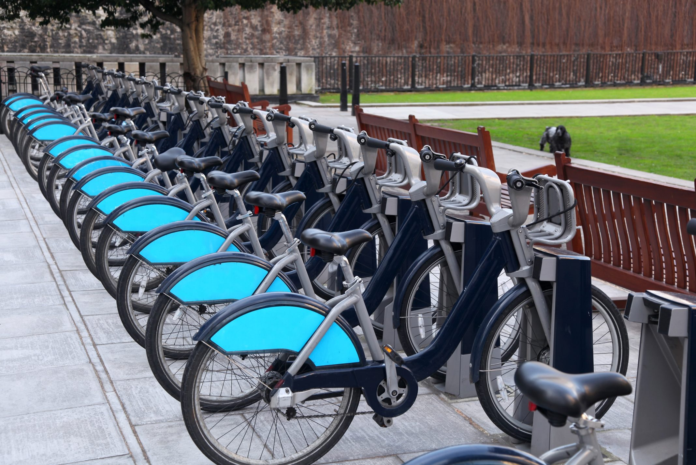

Cyclistic Case Study
================
Solihin Karsani
8/10/2021

## Introduction

### Background Information:

In 2016, Cyclistic launched a successful bike-share offering. Since
then, the program has grown to a fleet of 5,824 bicycles that are
geotracked and locked into a network of 692 stations across Chicago. The
bikes can be unlocked from one station and returned to any other station
in the system anytime.

Until now, Cyclistic’s marketing strategy relied on building general
awareness and appealing to broad consumer segments. One approach that
helped make these things possible was the flexibility of its pricing
plans: single-ride passes, full-day passes, and annual memberships.
Customers who purchase single-ride or full-day passes are referred to as
casual riders. Customers who purchase annual memberships are Cyclistic
members.

### The Problem:

Cyclistic’s finance analysts have concluded that annual members are much
more profitable than casual riders. Although the pricing flexibility
helps Cyclistic attract more customers, **the executive team believes
that maximizing the number of annual members will be key to future
growth**. Rather than creating a marketing campaign that targets all-new
customers, there is a very good chance to convert casual riders into
members with targeted marketing.

### Objective:

  - To better understand how annual members and casual riders differ.
  - To determine why casual riders would buy a membership.

**The insights generated from this analysis would allow Cyclistic to
design marketing strategies aimed at converting casual riders into
annual members.**



### Load Libraries

``` r
# disable scientific notation
options(scipen = 999)

library('tidyverse')
library('lubridate')
library('ggplot2')
library('ggmap') 
library('gridExtra')
```

### Load Data

We will use data from Apr-2020 to Mar-2021 for this analysis. Data is
provided by month and we will merge them into one dataframe.

``` r
# load individual datasets

tripdata_2020_04 <- read.csv("data/csv/202004-divvy-tripdata.csv")
tripdata_2020_05 <- read.csv("data/csv/202005-divvy-tripdata.csv")
tripdata_2020_06 <- read.csv("data/csv/202006-divvy-tripdata.csv")
tripdata_2020_07 <- read.csv("data/csv/202007-divvy-tripdata.csv")
tripdata_2020_08 <- read.csv("data/csv/202008-divvy-tripdata.csv")
tripdata_2020_09 <- read.csv("data/csv/202009-divvy-tripdata.csv")
tripdata_2020_10 <- read.csv("data/csv/202010-divvy-tripdata.csv")
tripdata_2020_11 <- read.csv("data/csv/202011-divvy-tripdata.csv")
tripdata_2020_12 <- read.csv("data/csv/202012-divvy-tripdata.csv")
tripdata_2021_01 <- read.csv("data/csv/202101-divvy-tripdata.csv")
tripdata_2021_02 <- read.csv("data/csv/202102-divvy-tripdata.csv")
tripdata_2021_03 <- read.csv("data/csv/202103-divvy-tripdata.csv")
```

``` r
# display sample data

head(tripdata_2020_04)
```

    ##            ride_id rideable_type          started_at            ended_at
    ## 1 A847FADBBC638E45   docked_bike 2020-04-26 17:45:14 2020-04-26 18:12:03
    ## 2 5405B80E996FF60D   docked_bike 2020-04-17 17:08:54 2020-04-17 17:17:03
    ## 3 5DD24A79A4E006F4   docked_bike 2020-04-01 17:54:13 2020-04-01 18:08:36
    ## 4 2A59BBDF5CDBA725   docked_bike 2020-04-07 12:50:19 2020-04-07 13:02:31
    ## 5 27AD306C119C6158   docked_bike 2020-04-18 10:22:59 2020-04-18 11:15:54
    ## 6 356216E875132F61   docked_bike 2020-04-30 17:55:47 2020-04-30 18:01:11
    ##                    start_station_name start_station_id
    ## 1                        Eckhart Park               86
    ## 2           Drake Ave & Fullerton Ave              503
    ## 3                McClurg Ct & Erie St              142
    ## 4        California Ave & Division St              216
    ## 5                Rush St & Hubbard St              125
    ## 6 Mies van der Rohe Way & Chicago Ave              173
    ##              end_station_name end_station_id start_lat start_lng end_lat
    ## 1 Lincoln Ave & Diversey Pkwy            152   41.8964  -87.6610 41.9322
    ## 2             Kosciuszko Park            499   41.9244  -87.7154 41.9306
    ## 3  Indiana Ave & Roosevelt Rd            255   41.8945  -87.6179 41.8679
    ## 4      Wood St & Augusta Blvd            657   41.9030  -87.6975 41.8992
    ## 5  Sheridan Rd & Lawrence Ave            323   41.8902  -87.6262 41.9695
    ## 6     Streeter Dr & Grand Ave             35   41.8969  -87.6217 41.8923
    ##    end_lng member_casual
    ## 1 -87.6586        member
    ## 2 -87.7238        member
    ## 3 -87.6230        member
    ## 4 -87.6722        member
    ## 5 -87.6547        casual
    ## 6 -87.6120        member

``` r
# merging into one dataframe

full_df <- rbind(tripdata_2020_04,
                 tripdata_2020_05,
                 tripdata_2020_06, 
                 tripdata_2020_07,
                 tripdata_2020_08, 
                 tripdata_2020_09,
                 tripdata_2020_10, 
                 tripdata_2020_11,
                 tripdata_2020_12,
                 tripdata_2021_01,
                 tripdata_2021_02,
                 tripdata_2021_03)

# get dimensions of resulting dataframe
print(dim(full_df))
```

    ## [1] 3489748      13

``` r
# rename column member_casual

full_df <- full_df %>%
    rename(member_type = member_casual)
```

### Data Quality Check

``` r
# check for duplicate rows

# get unique count of ride ID
print(n_distinct(full_df$ride_id))
```

    ## [1] 3489539

There are 209 duplicates in the merged dataframe. We will go ahead and
remove them.

``` r
# drop duplicates
full_df <- full_df[!duplicated(full_df$ride_id), ]

# get dimensions of resulting dataframe
print(dim(full_df))
```

    ## [1] 3489539      13

``` r
# get unique count of ride ID
print(n_distinct(full_df$ride_id))
```

    ## [1] 3489539

``` r
# check data types

str(full_df)
```

    ## 'data.frame':    3489539 obs. of  13 variables:
    ##  $ ride_id           : chr  "A847FADBBC638E45" "5405B80E996FF60D" "5DD24A79A4E006F4" "2A59BBDF5CDBA725" ...
    ##  $ rideable_type     : chr  "docked_bike" "docked_bike" "docked_bike" "docked_bike" ...
    ##  $ started_at        : chr  "2020-04-26 17:45:14" "2020-04-17 17:08:54" "2020-04-01 17:54:13" "2020-04-07 12:50:19" ...
    ##  $ ended_at          : chr  "2020-04-26 18:12:03" "2020-04-17 17:17:03" "2020-04-01 18:08:36" "2020-04-07 13:02:31" ...
    ##  $ start_station_name: chr  "Eckhart Park" "Drake Ave & Fullerton Ave" "McClurg Ct & Erie St" "California Ave & Division St" ...
    ##  $ start_station_id  : chr  "86" "503" "142" "216" ...
    ##  $ end_station_name  : chr  "Lincoln Ave & Diversey Pkwy" "Kosciuszko Park" "Indiana Ave & Roosevelt Rd" "Wood St & Augusta Blvd" ...
    ##  $ end_station_id    : chr  "152" "499" "255" "657" ...
    ##  $ start_lat         : num  41.9 41.9 41.9 41.9 41.9 ...
    ##  $ start_lng         : num  -87.7 -87.7 -87.6 -87.7 -87.6 ...
    ##  $ end_lat           : num  41.9 41.9 41.9 41.9 42 ...
    ##  $ end_lng           : num  -87.7 -87.7 -87.6 -87.7 -87.7 ...
    ##  $ member_type       : chr  "member" "member" "member" "member" ...

``` r
# convert started_at and ended_at to datetime format

full_df$started_at <- as.POSIXct(full_df$started_at, "%Y-%m-%d %H:%M:%S", tz = 'GMT')
full_df$ended_at <- as.POSIXct(full_df$ended_at, "%Y-%m-%d %H:%M:%S", tz = 'GMT')
```

``` r
# check resulting data type

str(full_df$started_at)
```

    ##  POSIXct[1:3489539], format: "2020-04-26 17:45:14" "2020-04-17 17:08:54" "2020-04-01 17:54:13" ...

``` r
str(full_df$ended_at)
```

    ##  POSIXct[1:3489539], format: "2020-04-26 18:12:03" "2020-04-17 17:17:03" "2020-04-01 18:08:36" ...

``` r
# check for null values

map(full_df, ~sum(is.na(.)))
```

    ## $ride_id
    ## [1] 0
    ## 
    ## $rideable_type
    ## [1] 0
    ## 
    ## $started_at
    ## [1] 0
    ## 
    ## $ended_at
    ## [1] 0
    ## 
    ## $start_station_name
    ## [1] 0
    ## 
    ## $start_station_id
    ## [1] 83583
    ## 
    ## $end_station_name
    ## [1] 0
    ## 
    ## $end_station_id
    ## [1] 98104
    ## 
    ## $start_lat
    ## [1] 0
    ## 
    ## $start_lng
    ## [1] 0
    ## 
    ## $end_lat
    ## [1] 4737
    ## 
    ## $end_lng
    ## [1] 4737
    ## 
    ## $member_type
    ## [1] 0

There are over 90k rows with null values in the end\_station\_id column.
We will go ahead and drop them.

``` r
# drop null values
full_df_clean <- drop_na(full_df)

# check for null values
map(full_df_clean, ~sum(is.na(.)))
```

    ## $ride_id
    ## [1] 0
    ## 
    ## $rideable_type
    ## [1] 0
    ## 
    ## $started_at
    ## [1] 0
    ## 
    ## $ended_at
    ## [1] 0
    ## 
    ## $start_station_name
    ## [1] 0
    ## 
    ## $start_station_id
    ## [1] 0
    ## 
    ## $end_station_name
    ## [1] 0
    ## 
    ## $end_station_id
    ## [1] 0
    ## 
    ## $start_lat
    ## [1] 0
    ## 
    ## $start_lng
    ## [1] 0
    ## 
    ## $end_lat
    ## [1] 0
    ## 
    ## $end_lng
    ## [1] 0
    ## 
    ## $member_type
    ## [1] 0

``` r
# get dimensions of resulting dataframe
print(dim(full_df_clean))
```

    ## [1] 3354306      13

### Data Mining

We can extract individual date parts which can be useful for our
analysis.

``` r
# extract date
full_df_clean$date <- as.Date(full_df_clean$started_at) 

# extract month
full_df_clean$month <- format(as.Date(full_df_clean$date), "%m")

# extract day
full_df_clean$day <- format(as.Date(full_df_clean$date), "%d")

# extract year
full_df_clean$year <- format(as.Date(full_df_clean$date), "%Y")

# extract day of week
full_df_clean$day_of_week <- format(as.Date(full_df_clean$date), "%A")

# extract ride start hour
full_df_clean <- full_df_clean %>%
    mutate(start_hour = strftime(full_df_clean$started_at, tz = "GMT", "%H"))
```

``` r
# create year-month column, since our data is distributed over 2 years

full_df_clean$year_month <- paste(full_df_clean$year, "-", full_df_clean$month)
```

``` r
head(full_df_clean)
```

    ##            ride_id rideable_type          started_at            ended_at
    ## 1 A847FADBBC638E45   docked_bike 2020-04-26 17:45:14 2020-04-26 18:12:03
    ## 2 5405B80E996FF60D   docked_bike 2020-04-17 17:08:54 2020-04-17 17:17:03
    ## 3 5DD24A79A4E006F4   docked_bike 2020-04-01 17:54:13 2020-04-01 18:08:36
    ## 4 2A59BBDF5CDBA725   docked_bike 2020-04-07 12:50:19 2020-04-07 13:02:31
    ## 5 27AD306C119C6158   docked_bike 2020-04-18 10:22:59 2020-04-18 11:15:54
    ## 6 356216E875132F61   docked_bike 2020-04-30 17:55:47 2020-04-30 18:01:11
    ##                    start_station_name start_station_id
    ## 1                        Eckhart Park               86
    ## 2           Drake Ave & Fullerton Ave              503
    ## 3                McClurg Ct & Erie St              142
    ## 4        California Ave & Division St              216
    ## 5                Rush St & Hubbard St              125
    ## 6 Mies van der Rohe Way & Chicago Ave              173
    ##              end_station_name end_station_id start_lat start_lng end_lat
    ## 1 Lincoln Ave & Diversey Pkwy            152   41.8964  -87.6610 41.9322
    ## 2             Kosciuszko Park            499   41.9244  -87.7154 41.9306
    ## 3  Indiana Ave & Roosevelt Rd            255   41.8945  -87.6179 41.8679
    ## 4      Wood St & Augusta Blvd            657   41.9030  -87.6975 41.8992
    ## 5  Sheridan Rd & Lawrence Ave            323   41.8902  -87.6262 41.9695
    ## 6     Streeter Dr & Grand Ave             35   41.8969  -87.6217 41.8923
    ##    end_lng member_type       date month day year day_of_week start_hour
    ## 1 -87.6586      member 2020-04-26    04  26 2020      Sunday         17
    ## 2 -87.7238      member 2020-04-17    04  17 2020      Friday         17
    ## 3 -87.6230      member 2020-04-01    04  01 2020   Wednesday         17
    ## 4 -87.6722      member 2020-04-07    04  07 2020     Tuesday         12
    ## 5 -87.6547      casual 2020-04-18    04  18 2020    Saturday         10
    ## 6 -87.6120      member 2020-04-30    04  30 2020    Thursday         17
    ##   year_month
    ## 1  2020 - 04
    ## 2  2020 - 04
    ## 3  2020 - 04
    ## 4  2020 - 04
    ## 5  2020 - 04
    ## 6  2020 - 04

We can also extract useful information from the bike rides (duration,
distance etc).

``` r
# create new column ride_duration_mins -> total ride duration in mins

full_df_clean <- full_df_clean %>%
    mutate(ride_duration_mins = as.numeric(full_df_clean$ended_at - full_df_clean$started_at) / 60)
```

``` r
summary(full_df_clean$ride_duration_mins)
```

    ##      Min.   1st Qu.    Median      Mean   3rd Qu.      Max. 
    ## -29049.97      7.97     14.62     26.32     26.72  58720.03

It appears that there are rides where the end time is before the start
time. We will treat this as a data entry error and will go ahead to drop
them from our dataframe.

``` r
# check rides with negative ride duration

head(filter(full_df_clean, ride_duration_mins < 0))
```

    ##            ride_id rideable_type          started_at            ended_at
    ## 1 7C1E92200AEFF70E   docked_bike 2020-04-27 17:20:30 2020-04-27 17:20:18
    ## 2 671BB1F73F4CD303   docked_bike 2020-04-20 16:51:18 2020-04-20 16:51:05
    ## 3 502B972C6B1FCAE6   docked_bike 2020-04-12 19:09:54 2020-04-12 19:09:40
    ## 4 68E70FDF06F0A439   docked_bike 2020-04-29 17:37:11 2020-04-29 17:37:07
    ## 5 6EB323BCC83A9D1D   docked_bike 2020-04-05 15:46:12 2020-04-05 15:46:11
    ## 6 90105A0FA1F2B0F3   docked_bike 2020-04-13 14:06:59 2020-04-13 14:06:45
    ##            start_station_name start_station_id             end_station_name
    ## 1      St. Clair St & Erie St              211 Clinton St & Washington Blvd
    ## 2 Lake Shore Dr & Belmont Ave              334          Buckingham Fountain
    ## 3      Clark St & Schiller St              301        Wells St & Concord Ln
    ## 4      Dearborn St & Adams St               37     California Ave & 23rd Pl
    ## 5  Francisco Ave & Foster Ave              471     Damen Ave & Clybourn Ave
    ## 6    Racine Ave & Belmont Ave              226      Broadway & Waveland Ave
    ##   end_station_id start_lat start_lng end_lat  end_lng member_type       date
    ## 1             91   41.8944  -87.6227 41.8834 -87.6412      member 2020-04-27
    ## 2              2   41.9408  -87.6392 41.8765 -87.6205      casual 2020-04-20
    ## 3            289   41.9080  -87.6315 41.9121 -87.6347      member 2020-04-12
    ## 4            442   41.8794  -87.6298 41.8491 -87.6951      member 2020-04-29
    ## 5            163   41.9756  -87.7014 41.9319 -87.6779      member 2020-04-05
    ## 6            304   41.9397  -87.6589 41.9491 -87.6486      casual 2020-04-13
    ##   month day year day_of_week start_hour year_month ride_duration_mins
    ## 1    04  27 2020      Monday         17  2020 - 04        -0.20000000
    ## 2    04  20 2020      Monday         16  2020 - 04        -0.21666667
    ## 3    04  12 2020      Sunday         19  2020 - 04        -0.23333333
    ## 4    04  29 2020   Wednesday         17  2020 - 04        -0.06666667
    ## 5    04  05 2020      Sunday         15  2020 - 04        -0.01666667
    ## 6    04  13 2020      Monday         14  2020 - 04        -0.23333333

``` r
# number of rows with negative ride duration

dim(filter(full_df_clean, ride_duration_mins < 0))[1]
```

    ## [1] 10310

``` r
# drop rows with negative ride duration
full_df_clean <- subset(full_df_clean, ride_duration_mins > 0)

# get dimensions of resulting dataframe
print(dim(full_df_clean))
```

    ## [1] 3343689      21

``` r
summary(full_df_clean$ride_duration_mins)
```

    ##     Min.  1st Qu.   Median     Mean  3rd Qu.     Max. 
    ##     0.02     8.02    14.67    27.85    26.78 58720.03

``` r
# apply function

full_df_clean <- euclidean.dist(full_df_clean)
```

``` r
head(full_df_clean)
```

    ##            ride_id rideable_type          started_at            ended_at
    ## 1 A847FADBBC638E45   docked_bike 2020-04-26 17:45:14 2020-04-26 18:12:03
    ## 2 5405B80E996FF60D   docked_bike 2020-04-17 17:08:54 2020-04-17 17:17:03
    ## 3 5DD24A79A4E006F4   docked_bike 2020-04-01 17:54:13 2020-04-01 18:08:36
    ## 4 2A59BBDF5CDBA725   docked_bike 2020-04-07 12:50:19 2020-04-07 13:02:31
    ## 5 27AD306C119C6158   docked_bike 2020-04-18 10:22:59 2020-04-18 11:15:54
    ## 6 356216E875132F61   docked_bike 2020-04-30 17:55:47 2020-04-30 18:01:11
    ##                    start_station_name start_station_id
    ## 1                        Eckhart Park               86
    ## 2           Drake Ave & Fullerton Ave              503
    ## 3                McClurg Ct & Erie St              142
    ## 4        California Ave & Division St              216
    ## 5                Rush St & Hubbard St              125
    ## 6 Mies van der Rohe Way & Chicago Ave              173
    ##              end_station_name end_station_id start_lat start_lng end_lat
    ## 1 Lincoln Ave & Diversey Pkwy            152   41.8964  -87.6610 41.9322
    ## 2             Kosciuszko Park            499   41.9244  -87.7154 41.9306
    ## 3  Indiana Ave & Roosevelt Rd            255   41.8945  -87.6179 41.8679
    ## 4      Wood St & Augusta Blvd            657   41.9030  -87.6975 41.8992
    ## 5  Sheridan Rd & Lawrence Ave            323   41.8902  -87.6262 41.9695
    ## 6     Streeter Dr & Grand Ave             35   41.8969  -87.6217 41.8923
    ##    end_lng member_type       date month day year day_of_week start_hour
    ## 1 -87.6586      member 2020-04-26    04  26 2020      Sunday         17
    ## 2 -87.7238      member 2020-04-17    04  17 2020      Friday         17
    ## 3 -87.6230      member 2020-04-01    04  01 2020   Wednesday         17
    ## 4 -87.6722      member 2020-04-07    04  07 2020     Tuesday         12
    ## 5 -87.6547      casual 2020-04-18    04  18 2020    Saturday         10
    ## 6 -87.6120      member 2020-04-30    04  30 2020    Thursday         17
    ##   year_month ride_duration_mins distance_km
    ## 1  2020 - 04           26.81667   3.9901987
    ## 2  2020 - 04            8.15000   0.9799703
    ## 3  2020 - 04           14.38333   2.9911193
    ## 4  2020 - 04           12.20000   2.1384887
    ## 5  2020 - 04           52.91667   9.1377451
    ## 6  2020 - 04            5.40000   0.9530329

### Analyse Data

``` r
# number of rides by casual vs member riders

full_df_clean %>% 
    group_by(member_type) %>% 
    summarise(total_rides = length(ride_id),
              'perc_of_total' = (length(ride_id) / nrow(full_df_clean)) * 100)
```

    ## # A tibble: 2 x 3
    ##   member_type total_rides perc_of_total
    ##   <chr>             <int>         <dbl>
    ## 1 casual          1366517          40.9
    ## 2 member          1977172          59.1

Rides by members account for approximately 59% of the dataset for the
12-months period.

``` r
# number of rides per month

rides_per_month <- total_rides(df = full_df_clean, var = year_month)
rides_per_month[order(rides_per_month$year_month, decreasing = TRUE),]
```

    ## # A tibble: 24 x 4
    ## # Groups:   member_type [2]
    ##    member_type year_month total_rides perc_of_total
    ##    <chr>       <chr>            <int>         <dbl>
    ##  1 casual      2021 - 03        83918         2.51 
    ##  2 member      2021 - 03       144399         4.32 
    ##  3 casual      2021 - 02        10072         0.301
    ##  4 member      2021 - 02        39332         1.18 
    ##  5 casual      2021 - 01        18095         0.541
    ##  6 member      2021 - 01        78631         2.35 
    ##  7 casual      2020 - 12        29960         0.896
    ##  8 member      2020 - 12       101062         3.02 
    ##  9 casual      2020 - 11        72847         2.18 
    ## 10 member      2020 - 11       149069         4.46 
    ## # ... with 14 more rows

``` r
# get % difference between casual riders vs members

rides_percent_diff_month <- rides_perc_diff(df = full_df_clean, var = year_month)
rides_percent_diff_month[order(rides_percent_diff_month$year_month, decreasing = TRUE),]
```

    ## # A tibble: 12 x 6
    ##    year_month total_rides perc_of_total member_riders_perc casual_riders_perc
    ##    <chr>            <int>         <dbl>              <dbl>              <dbl>
    ##  1 2021 - 03       228317          6.83               63.2               36.8
    ##  2 2021 - 02        49404          1.48               79.6               20.4
    ##  3 2021 - 01        96726          2.89               81.3               18.7
    ##  4 2020 - 12       131022          3.92               77.1               22.9
    ##  5 2020 - 11       221916          6.64               67.2               32.8
    ##  6 2020 - 10       337375         10.1                63.7               36.3
    ##  7 2020 - 09       498228         14.9                56.9               43.1
    ##  8 2020 - 08       605652         18.1                53.4               46.6
    ##  9 2020 - 07       548617         16.4                51.1               48.9
    ## 10 2020 - 06       342040         10.2                54.9               45.1
    ## 11 2020 - 05       199772          5.97               56.6               43.4
    ## 12 2020 - 04        84620          2.53               72.2               27.8
    ## # ... with 1 more variable: relative_diff_perc <dbl>

``` r
# plot monthly counts

fig(20, 8)

full_df_clean %>%
    ggplot(aes(year_month, fill = member_type)) +
    geom_bar(position = 'dodge') +
    labs(x = 'Month', title = 'Total Rides per Month') +
    coord_flip() + 
    theme(plot.title = element_text(size = 22), 
          axis.text = element_text(size = 14),
          axis.title = element_text(size = 16),
          axis.title.x = element_blank(),
          legend.title = element_text(size = 16),
          legend.text = element_text(size = 14))
```

<!-- -->

Some insights gathered from this chart:

  - Aug-2020 had the most rides, approximately 18.1% of the total rides.
  - Feb-2021 had the least rides, approximately 1.5% of the total rides.
  - There were more rides by members for each month during the 12-months
    period.
  - Jan-2021 had the largest relative difference between both groups,
    approximately 77%.
  - Jul-2020 had the smallest relative difference between both groups,
    approximately 4.4%.

The distribution looks cyclical and seems to follow the seasonal
weather. Let’s compare it with climate data for Chicago. We will use
data from [Climate of
Chicago](https://en.wikipedia.org/wiki/Climate_of_Chicago).

``` r
# store monthly mean temperature of Chicago (C)
chicago_mean_temp <- c(-3.2, -1.2, 4.4, 10.5, 16.6, 22.2, 24.8, 23.9, 19.9, 12.9, 5.8, -0.3)

# create a 'Month' list
month <- c('01 - Jan', '02 - Feb', 
           '03 - Mar', '04 - Apr', 
           '05 - May', '06 - Jun', 
           '07 - Jul', '08 - Aug', 
           '09 - Sep', '10 - Oct', 
           '11 - Nov', '12 - Dec')

# plot monthly mean temperature of Chicago
fig(20, 8)

data.frame(month, chicago_mean_temp) %>%
    ggplot(aes(x = month, y = chicago_mean_temp)) +
    labs(x = 'Month', y = 'Mean temperature (C)', title = 'Mean temperature for Chicago (1991-2020)') +
    geom_col() +
    theme(plot.title = element_text(size = 22), 
          axis.text = element_text(size = 14),
          axis.title = element_text(size = 16),
          axis.title.x = element_blank())
```

<!-- -->

There appears to be a direct correlation between the temperature and the
number of rides. This is possible as harsh winter conditions may be
dangerous for cycling. Jun-2020 to Oct-2020 accounts for \> 68% of the
total rides. The temperatues during these months are more favourable for
cycling.

``` r
# total rides by day of week

rides_per_DoW <- total_rides(df = full_df_clean, var = day_of_week)
rides_per_DoW[order(rides_per_DoW$day_of_week),]
```

    ## # A tibble: 14 x 4
    ## # Groups:   member_type [2]
    ##    member_type day_of_week total_rides perc_of_total
    ##    <chr>       <fct>             <int>         <dbl>
    ##  1 casual      Monday           144491          4.32
    ##  2 member      Monday           257574          7.70
    ##  3 casual      Tuesday          138738          4.15
    ##  4 member      Tuesday          274525          8.21
    ##  5 casual      Wednesday        151017          4.52
    ##  6 member      Wednesday        294769          8.82
    ##  7 casual      Thursday         158383          4.74
    ##  8 member      Thursday         289445          8.66
    ##  9 casual      Friday           198883          5.95
    ## 10 member      Friday           294737          8.81
    ## 11 casual      Saturday         322416          9.64
    ## 12 member      Saturday         310828          9.30
    ## 13 casual      Sunday           252589          7.55
    ## 14 member      Sunday           255294          7.64

``` r
# get % difference between casual riders vs members

rides_percent_diff_DoW <- rides_perc_diff(df = full_df_clean, var = day_of_week)
rides_percent_diff_DoW
```

    ## # A tibble: 7 x 6
    ##   day_of_week total_rides perc_of_total member_riders_perc casual_riders_perc
    ##   <fct>             <int>         <dbl>              <dbl>              <dbl>
    ## 1 Monday           402065          12.0               64.1               35.9
    ## 2 Tuesday          413263          12.4               66.4               33.6
    ## 3 Wednesday        445786          13.3               66.1               33.9
    ## 4 Thursday         447828          13.4               64.6               35.4
    ## 5 Friday           493620          14.8               59.7               40.3
    ## 6 Saturday         633244          18.9               49.1               50.9
    ## 7 Sunday           507883          15.2               50.3               49.7
    ## # ... with 1 more variable: relative_diff_perc <dbl>

``` r
# calculate mean relative % difference for weekdays

weekday_rides <- rides_percent_diff_DoW %>%
    filter(day_of_week == 'Monday' |
           day_of_week == 'Tuesday' |
           day_of_week == 'Wednesday' |
           day_of_week == 'Thursday' |
           day_of_week == 'Friday')
           
           
mean(weekday_rides$relative_diff_perc)
```

    ## [1] 43.98713

``` r
# plot daily counts

fig(20, 8)

full_df_clean %>%
    ggplot(aes(day_of_week, fill = member_type)) +
    geom_bar(position = 'dodge') +
    labs(x = 'Day of Week', title = 'Total Rides per DoW') +
    coord_flip() + 
    theme(plot.title = element_text(size = 22), 
          axis.text = element_text(size = 14),
          axis.title = element_text(size = 16),
          axis.title.x = element_blank(),
          legend.title = element_text(size = 16),
          legend.text = element_text(size = 14))
```

<!-- -->

Some insights gathered from this chart:

  - Total rides during weekends is almost distributed equally among
    members and casual riders.
  - The average relative difference between the 2 groups during weekdays
    is 43.99%.
  - Except Saturday, there were more rides by members for each day of
    week during the 12-months period.
  - It is likely that members are mainly using the bikes as their
    primary mode of transportation for work during office hours.
  - Casual riders may be riding on adhoc basis or for leisure.

<!-- end list -->

``` r
# total rides by hour of day

rides_per_HoD <- total_rides(df = full_df_clean, var = start_hour)
rides_per_HoD[order(rides_per_HoD$start_hour),]
```

    ## # A tibble: 48 x 4
    ## # Groups:   member_type [2]
    ##    member_type start_hour total_rides perc_of_total
    ##    <chr>       <chr>            <int>         <dbl>
    ##  1 casual      00               21307        0.637 
    ##  2 member      00               11221        0.336 
    ##  3 casual      01               13261        0.397 
    ##  4 member      01                6274        0.188 
    ##  5 casual      02                7295        0.218 
    ##  6 member      02                3353        0.100 
    ##  7 casual      03                3854        0.115 
    ##  8 member      03                2116        0.0633
    ##  9 casual      04                3183        0.0952
    ## 10 member      04                3355        0.100 
    ## # ... with 38 more rows

``` r
# get % difference between casual riders vs members

rides_percent_diff_HoD <- rides_perc_diff(df = full_df_clean, var = start_hour)
rides_percent_diff_HoD
```

    ## # A tibble: 24 x 6
    ##    start_hour total_rides perc_of_total member_riders_perc casual_riders_perc
    ##    <chr>            <int>         <dbl>              <dbl>              <dbl>
    ##  1 00               32528         0.973               34.5               65.5
    ##  2 01               19535         0.584               32.1               67.9
    ##  3 02               10648         0.318               31.5               68.5
    ##  4 03                5970         0.179               35.4               64.6
    ##  5 04                6538         0.196               51.3               48.7
    ##  6 05               21846         0.653               76.7               23.3
    ##  7 06               67353         2.01                81.7               18.3
    ##  8 07              114306         3.42                80.6               19.4
    ##  9 08              130064         3.89                76.7               23.3
    ## 10 09              123076         3.68                68.3               31.7
    ## # ... with 14 more rows, and 1 more variable: relative_diff_perc <dbl>

``` r
# plot hourly counts

fig(20, 8)

full_df_clean %>%
    ggplot(aes(start_hour, fill = member_type)) +
    geom_bar(position = 'dodge') +
    labs(x = 'Ride Start Hour', title = 'Total Rides per HoD') + 
    theme(plot.title = element_text(size = 22), 
          axis.text = element_text(size = 14),
          axis.title = element_text(size = 16),
          axis.title.y = element_blank(),
          legend.title = element_text(size = 16),
          legend.text = element_text(size = 14))
```

<!-- -->

Some insights gathered from this chart:

  - There are more rides by casual riders for rides that started between
    2100hrs to 0300hrs.
  - The largest relative difference are for rides that started between
    0500hrs and 0800hrs.
  - This trend seems to support our earlier analysis that members are
    mainly using the bikes as their primary mode of transportation for
    work during office hours.

<!-- end list -->

``` r
# plot weekday vs weekend comparison

fig(20, 12)
full_df_clean %>%
    mutate(part_of_week = ifelse(day_of_week == 'Saturday' | day_of_week == 'Sunday',
                                   'Weekend',
                                   'Weekday')) %>%
    ggplot(aes(start_hour, fill = member_type)) +
    labs(x = 'Ride Start Hour', title = 'Total Rides per HoD') +
    geom_bar(position = 'dodge') +
    facet_wrap(~ part_of_week, nrow = 2) +
    theme(plot.title = element_text(size = 22),
          strip.text = element_text(size = 16),
          axis.text = element_text(size = 14),
          axis.title = element_text(size = 16),
          axis.title.y = element_blank(),
          legend.title = element_text(size = 16),
          legend.text = element_text(size = 14))
```

<!-- -->

It is interesting to see that the number of rides between the 2 groups
is almost equally distributed during weekends. While the trend for
weekdays is close to that of the entire week.

``` r
# total rides by bike type

rides_per_bike <- total_rides(df = full_df_clean, var = rideable_type)
rides_per_bike[order(rides_per_bike$rideable_type),]
```

    ## # A tibble: 6 x 4
    ## # Groups:   member_type [2]
    ##   member_type rideable_type total_rides perc_of_total
    ##   <chr>       <chr>               <int>         <dbl>
    ## 1 casual      classic_bike        70578          2.11
    ## 2 member      classic_bike       248719          7.44
    ## 3 casual      docked_bike       1111358         33.2 
    ## 4 member      docked_bike       1432357         42.8 
    ## 5 casual      electric_bike      184581          5.52
    ## 6 member      electric_bike      296096          8.86

``` r
# get % difference between casual riders vs members

rides_percent_diff_bike <- rides_perc_diff(df = full_df_clean, var = rideable_type)
rides_percent_diff_bike
```

    ## # A tibble: 3 x 6
    ##   rideable_type total_rides perc_of_total member_riders_perc casual_riders_perc
    ##   <chr>               <int>         <dbl>              <dbl>              <dbl>
    ## 1 classic_bike       319297          9.55               77.9               22.1
    ## 2 docked_bike       2543715         76.1                56.3               43.7
    ## 3 electric_bike      480677         14.4                61.6               38.4
    ## # ... with 1 more variable: relative_diff_perc <dbl>

``` r
# plot total rides by bike type

fig(16, 8)

full_df_clean %>%
    ggplot(aes(rideable_type, fill = member_type)) +
    geom_bar(position = 'dodge') +
    labs(x = 'Type of Bike', title = 'Total Rides per Bike Type') + 
    theme(plot.title = element_text(size = 22), 
          axis.text = element_text(size = 14),
          axis.title = element_text(size = 16),
          axis.title.y = element_blank(),
          legend.title = element_text(size = 16),
          legend.text = element_text(size = 14))
```

<!-- -->

``` r
# calculate individual percentage share

casual %>%
    group_by(rideable_type) %>%
    summarise(total_rides = length(ride_id),
             'perc_of_total' = (length(ride_id) / nrow(casual)) * 100)
```

    ## # A tibble: 3 x 3
    ##   rideable_type total_rides perc_of_total
    ##   <chr>               <int>         <dbl>
    ## 1 classic_bike        70578          5.16
    ## 2 docked_bike       1111358         81.3 
    ## 3 electric_bike      184581         13.5

``` r
# calculate individual percentage share

member %>%
    group_by(rideable_type) %>%
    summarise(total_rides = length(ride_id),
             'perc_of_total' = (length(ride_id) / nrow(member)) * 100)
```

    ## # A tibble: 3 x 3
    ##   rideable_type total_rides perc_of_total
    ##   <chr>               <int>         <dbl>
    ## 1 classic_bike       248719          12.6
    ## 2 docked_bike       1432357          72.4
    ## 3 electric_bike      296096          15.0

``` r
# plot total rides by bike type for each group

fig(16, 8)

full_df_clean %>%
    ggplot(aes(member_type, fill = rideable_type)) +
    geom_bar(position = 'dodge') +
    labs(x = 'Type of Bike', title = 'Total Rides per Bike Type') + 
    theme(plot.title = element_text(size = 22), 
          axis.text = element_text(size = 14),
          axis.title = element_text(size = 16),
          axis.title.y = element_blank(),
          legend.title = element_text(size = 16),
          legend.text = element_text(size = 14))
```

<!-- -->

Some insights gathered from this chart:

  - There are more rides by members across all three bike types.
  - Casual riders prefer docked and electric bikes as compared to
    classic bikes.
  - 81% of rides by casual riders are with a docked bike, as compared to
    72% of rides by members.

<!-- end list -->

``` r
# calculate mean and median ride duration and distance covered for both groups

agg_duration_distance <- full_df_clean %>% 
    group_by(member_type) %>% 
    summarise(mean_duration_mins = mean(ride_duration_mins),
              median_duration_mins = median(ride_duration_mins),
              mean_distance_km = mean(distance_km),
              median_distance_km = median(distance_km))

agg_duration_distance
```

    ## # A tibble: 2 x 5
    ##   member_type mean_duration_mins median_duration_mins mean_distance_km
    ##   <chr>                    <dbl>                <dbl>            <dbl>
    ## 1 casual                    45.1                 21.5             2.16
    ## 2 member                    15.9                 11.5             2.26
    ## # ... with 1 more variable: median_distance_km <dbl>

There is a distinct difference in the ride duration between casual and
member riders. This tells us that member riders are more likely to have
a destination in mind but casual riders are more likely using the bike
to explore places.

As for the distance covered, there is not much difference between the 2
groups.

``` r
# calculate mean and median ride duration and distance covered for both groups
# for each day of week

agg_duration_distance_DoW <- full_df_clean %>% 
    group_by(member_type, day_of_week) %>% 
    summarise(mean_duration_mins = mean(ride_duration_mins),
              median_duration_mins = median(ride_duration_mins),
              mean_distance_km = mean(distance_km),
              median_distance_km = median(distance_km))

agg_duration_distance_DoW[order(agg_duration_distance_DoW$day_of_week),]
```

    ## # A tibble: 14 x 6
    ## # Groups:   member_type [2]
    ##    member_type day_of_week mean_duration_mins median_duration_~ mean_distance_km
    ##    <chr>       <fct>                    <dbl>             <dbl>            <dbl>
    ##  1 casual      Monday                    45.1              21.1             2.04
    ##  2 member      Monday                    15.1              10.9             2.21
    ##  3 casual      Tuesday                   40.5              19.4             2.09
    ##  4 member      Tuesday                   15.0              10.9             2.21
    ##  5 casual      Wednesday                 40.5              18.8             2.13
    ##  6 member      Wednesday                 15.1              11.0             2.23
    ##  7 casual      Thursday                  43.2              18.9             2.13
    ##  8 member      Thursday                  15.0              11               2.22
    ##  9 casual      Friday                    42.9              20.1             2.18
    ## 10 member      Friday                    15.6              11.3             2.24
    ## 11 casual      Saturday                  47.1              23.7             2.30
    ## 12 member      Saturday                  17.7              13               2.37
    ## 13 casual      Sunday                    50.8              24.8             2.14
    ## 14 member      Sunday                    18.1              13.1             2.35
    ## # ... with 1 more variable: median_distance_km <dbl>

  - Casual riders tend to have longer rides for all days.
  - It is interesting to see that members mean ride duration is
    consistent during weekdays, which further supports our earlier
    observation.

### Findings

To sum up, the aim of this analysis is to determine how casual and
member riders differ in their usage of the shared bicycles and how the
marketing team can use the insights gathered to develop a targeted
marketing approach to get casual riders to purchase an annual
membership.

The main difference between casual and member riders are:

  - Members tend to use the bikes as their primary mode of
    transportation for work, as there were significantly higher
    percentage of rides by members between 0600hrs to 0800hrs and
    1700hrs to 1900hrs on weekdays.
  - Casual riders prefer docked bike over the other 2 options. This is
    likely because they do not have an end destination and wouldn’t mind
    having to return the bike to the original pickup point.
  - Casual riders tend to avoid cycling during winter.


### Recommendations

Based on the above findings, here are my top three recommendations:

  - Provide discounted rides for new members during weekdays morning and
    evening rush hour (for a certain period like the first month), to
    push towards making the bicycles as their primary mode of
    transportation.
  - Form a partnership with a sportswear brand (Decathlon) and provide
    discounts on cycling gears for members, with special emphasis on
    winter cycling gears.
  - Have a campaign where members can collect points once they cycled a
    particular route for a certain number of times (e.g. home -\> office
    or office -\> home). These points can then be used to redeem rides.
